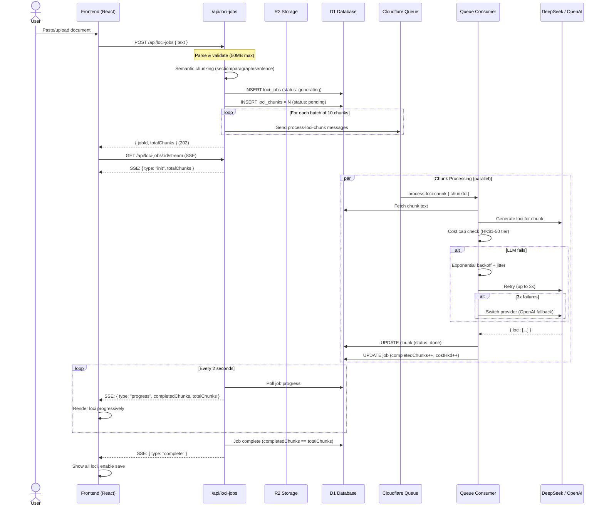

# Memory Palace — Chunked Streaming Pipeline

## Architecture



## Data Flow

```
┌─────────────────────────────────────────────────────────────────┐
│                         UPLOAD PHASE                             │
│                                                                  │
│  User Document ──► Parse (TXT/MD) ──► Validate size              │
│       │                                    │                     │
│       │ >50MB → reject (413)               │                     │
│       │                                    ▼                     │
│       │                           Semantic Chunker               │
│       │                           ┌─ Section split (H1-H6)       │
│       │                           ├─ Paragraph grouping          │
│       │                           ├─ Sentence boundary fallback  │
│       │                           └─ 1500-3000 token target      │
│       │                                    │                     │
│       │                           N chunks with 150-char overlap │
│       │                                    │                     │
│       └────────────────────────────────────┘                     │
│                         ▼                                        │
│                  D1: loci_jobs + loci_chunks                     │
└─────────────────────────────────────────────────────────────────┘

┌─────────────────────────────────────────────────────────────────┐
│                       PROCESSING PHASE                           │
│                                                                  │
│  Cloudflare Queue ──► Consumer picks up process-loci-chunk       │
│       │                                                          │
│       ▼                                                          │
│  ┌─────────────┐    ┌──────────────┐    ┌──────────────┐        │
│  │  Cost Check  │───►│  DeepSeek    │───►│  Store Loci  │        │
│  │  (tier cap)  │    │  Chat API    │    │  in D1       │        │
│  └─────────────┘    └──────┬───────┘    └──────────────┘        │
│                            │ fail                                │
│                            ▼                                     │
│                    ┌──────────────┐                              │
│                    │  Retry (3x)  │                              │
│                    │  Backoff 1s  │                              │
│                    │  → 60s max   │                              │
│                    └──────┬───────┘                              │
│                           │ 3x fail                              │
│                           ▼                                      │
│                    ┌──────────────┐                              │
│                    │  Provider    │                              │
│                    │  Fallback    │                              │
│                    │  (OpenAI)    │                              │
│                    └──────────────┘                              │
└─────────────────────────────────────────────────────────────────┘

┌─────────────────────────────────────────────────────────────────┐
│                       STREAMING PHASE                            │
│                                                                  │
│  Frontend ◄── SSE ──► /api/loci-jobs/:id/stream                 │
│       │                    │                                     │
│       │    event: progress │  Polls D1 every 2s                  │
│       │    event: complete │  (Last-Event-ID reconnect support)  │
│       │    event: error    │                                     │
│       │                    │                                     │
│       ▼                    ▼                                     │
│  ┌─────────────────────────────────┐                            │
│  │  Progress bar + live loci feed  │                            │
│  │  Retry button for failed chunks │                            │
│  │  Cost estimate toast            │                            │
│  └─────────────────────────────────┘                            │
└─────────────────────────────────────────────────────────────────┘
```

## Small Document Fast Path

Documents under 100KB (~25K tokens) still use the synchronous `POST /api/ai/generate-palace` endpoint:

```
User → /api/ai/generate-palace → DeepSeek (single call) → loci JSON → Frontend
```

No queue, no chunking, no SSE. Sub-5-second response for small docs.

Threshold: `contentLength < 100000 && totalChars < 100000` → sync path.

## Database Schema

### loci_jobs
| Column           | Type    | Description                              |
|------------------|---------|------------------------------------------|
| id               | TEXT PK | UUID                                     |
| user_id          | TEXT FK | → users.id                               |
| file_name        | TEXT    | Original filename                        |
| file_size        | INTEGER | Bytes                                    |
| r2_key           | TEXT    | R2 storage key (binary files)            |
| topic            | TEXT    | Subject/topic                            |
| total_chunks     | INTEGER | Number of chunks created                 |
| completed_chunks | INTEGER | Chunks processed successfully            |
| status           | TEXT    | pending|parsing|generating|completed|failed|cost_capped |
| error            | TEXT    | Last error message                       |
| plaintext_length | INTEGER | Parsed text length                       |
| estimated_tokens | INTEGER | Token estimate                           |
| cost_hkd         | REAL    | Running cost in HKD                      |
| created_at       | INT TS  |                                          |
| updated_at       | INT TS  |                                          |

### loci_chunks
| Column         | Type    | Description                       |
|----------------|---------|-----------------------------------|
| id             | TEXT PK | {jobId}-c{seqIndex}              |
| job_id         | TEXT FK | → loci_jobs.id                   |
| sequence_index | INTEGER | 0-based chunk order              |
| text           | TEXT    | Raw chunk text                   |
| token_count    | INTEGER | Estimated tokens                 |
| section_title  | TEXT    | Detected heading (nullable)      |
| loci            | TEXT    | JSON array of LocusData          |
| status         | TEXT    | pending|processing|done|failed   |
| retry_count    | INTEGER | Failed attempts                  |
| error          | TEXT    | Last error                       |

## Cost Model

| Model             | Input/1K tokens | Output/1K tokens |
|-------------------|-----------------|------------------|
| DeepSeek Chat     | HK$0.0021       | HK$0.0086        |
| GPT-4o-mini       | HK$0.0012       | HK$0.0047        |

Tier caps (HKD per job): Free $1 · Xueba $5 · Pro $10 · Founder $50.

## Cleanup

- Cron trigger runs every 6 hours: deletes loci_jobs + loci_chunks older than 24h with status pending/parsing/generating.
- R2: configure lifecycle rule to expire objects under `loci-uploads/` after 7 days.
